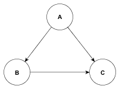
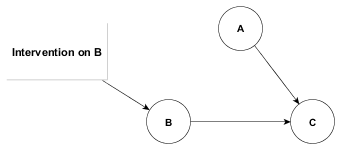
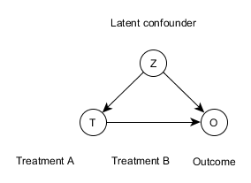
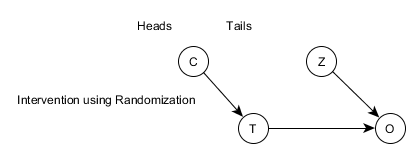

---
output:
  html_document:
    fig_caption: yes
---

```{r include=FALSE}
knitr::opts_chunk$set(echo = TRUE)
knitr::opts_chunk$set(fig.path="fig/")
```


# Introduction to Interventions

In this lecture we will learn about the meaning of interventions and their implication to prediction.


## Ladder of causality
  
The ladder of causality has 3 levels: 1) Association 2) Intervention 3) Counterfactual. Most of the definitions and examples in this section are from the book of why by Pearl.

```{r fig1, fig.cap = "Ladder of causality. from the book of why by pearl.", fig.height=7, fig.width=7 ,fig.align='center', echo=FALSE}
library(png)
library(grid)
img <- readPNG("./fig/Ladder_of_Causality.png")
grid.raster(img)
```

### Association 

The first level, Association is related to the cognitive ability of seeing or in other words observation. It includes broad class of statistically learned models (discriminiative and generative). In this level, we are looking for regularities in observations. This is what an owl does when observing how a rat moves and figuring out where the rodent is likely to be a moment later, and it is what a computer Go program does when it studies a database of millions of Go games so that it can figure out which moves are associated with a higher percentage of wins. We say that
one event is associated with another if observing one changes the likelihood of observing the other.

In the association level of the ladder of causality, we call for predictions based on passive observations. As it is noted in figure \@ref(fig:fig1) this level is characterized by the question "what if I see ...?" For example one example in this case is how likely is a customer who bought toothpaste to also by dental floss? This can be easily calculated in Statistics by gathering data on the customers who bought toothpaste and then among those focus on the ones who also bought dental floss. In other words, we want to calculate the conditional probability of $P(floss = 1 | toothpaste = 1)$. This will be calculated based on observational data or in other word based on what was seen. Statistics alone cannot tell whether buying floss is the cause of buying the toothpaste or vice versa. For the sales manager it really doesn't matter what is the causal relationship between this two items. Another example of association is "correlation" and "regression" which is a typical measure of association. Most of machine learning methods are also in the first ladder of causality like deep neural networks. In deep neural networks We are looking for a way to learn the association in a high dimensional non linear space. Deep learning has given us machines that have impressive abilities but no intelligence. They are driven by a stream of observations (raw data) to which they attempt to fit a function, just like how we fit a line in linear regression.

We can think of Association in terms of discriminative models. One common example of Association is Neural Network. Neural network brute forces things; the goal of a neural network is to find the right set of weights to bridge the input and output.

Another example of association is the Naive Bayes classifier. The DAG for Naive Bayes classifier can be given as follows:


** diagram will come here **

### Intervention

The second level of ladder of causality is intervention. It is when we begin to change the world. For the example of toothpaste and floss a question to ask for this level would be, "What will happen to our floss sales if we double the price of toothpaste?" This knowledge is absent from raw data and we cannot answer this question from passively collected data (raw data). In this case you want to deliberately intervene to the price of toothpaste regardless of any market conditions that may had affected the price in observational data (in your observational data you may see doubled prices for toothpaste as well as it's original price but that is due to market conditions like lack of toothpaste for a period of time). One way to predict the result of an intervention is to experiment with it under carefully controlled conditions. Even if we don't have an experiment to predict interventional results, if we have an accurate causal model, we are able to move from level 1 of the ladder to level 2. Later in this section we will talk about structural causal models (SCMs).

Level 2 of ladder of causality is characterized by the question "What if we do ...?" What will happen if we change the environment? In pearl's notation, for our thoothpaste example we write this kind of query as $P(floss | do(toothpaste))$. This tells us the probability that we will sell floss at a certain price, given that we set the price of toothpaste at another price. Note that this **do** operator is different from conditional probability. We will talk more about this in the next section.

### Counterfactual

Level 3 of ladder of causality is characterized by the question "What if I had done ...?" "Why?". A good example of a counterfactual question can be "Had Trump not fired Comey, would he have still been charged with obstruction of justice" to which Muller responded with another counterfactual statement. He said that if he did believe that a crime was committed, he would have said so. No experiment can go back in time to see the effect of a different treatment on the patient when all other conditions are fixed. The data that we have cannot tell us what will happen in a counterfactual or imaginary world, but the human mind makes these inferences reliably all the time. Causal Bayesian networks cannot answer counterfactual questions. For toothpaste example, we can ask "What is the probability that a customer who already bouth toothpaste would still have bought it if we had doubled the price?". Having a causal model that can answer counterfactual questions is very valuable. We call these models Structural causal models (SCMs) that can be implemented in a probabilistic programming language. Structural causal models look like a causal Bayesian network except all the variables in the joint distribution are going to be a deterministic function derived from its parents and some noise.

Let's take an example of Laplace's demon - If someone (the demon) knows the precise location and momentum of every atom in the universe, their past and future values for any given time are entailed; they can be calculated from the laws of Newtonian mechanics.

Any variable in a Structural Causal Model is a deterministic function of its parents and some noise.


Let's take an example

```{}
def program(noise):
    # define X
  	# N_X = noise[x].sample()
    # define y
    # N_y = noise[y].sample()
    # X = fx(Nx)
    # Y = fy(X, Ny)
```

This program can be the program of Newtonian mechanics which accepts all the noise as pre-conditions and hence becomes determnistic.

## Interventions and implications to prediction

  Interventions are one level above Associations in the ladder of causality. Conceptually speaking, as the word suggests, intervention means to change something. An example of intervention is "How would my expected lifestyle change if I become a vegetarian?" This is a concept used extensively in reinforcement learning.

### Relationship between intervention and causation

Intervention helps to find causal relationship. Considering a simple case where A and B are only two nodes in BayesNet. Their association implies either A causes B or B causes A. With intervention of A, if probability of B changes, then A is the cause, otherwise B is the cause.
  
There is a lot of philosophical controversy associated with the intervention and causation. Paul Holland firmly believes that "There is no causation without intervention". This implies that we cannot simply say that obesity is the cause of heart attack since obesity cannot be meaningfully intervened (i.e. Obesity can't be set individually without perturbing other factors that leads to obesity). Only factors that can be meaningfully intervened qualify as a cause of a given outcome.

### Relationship between intervention and prediction

Reasoning of intervention allows us to predict outcome, when it is not feasible to do the intervention. One can calculate the theoretical effect on an intervention without actually doing anything.Interventions are important to separate correlation from causation.
  
It is important to understand the implications of an intervention to prediction. Consider 2 examples: predicting the weather vs predicting the sales. It makes more sense to apply an intervention to predict the sales than to predict the weather, since sales but weather may be changed by intervention. Intervention can be used to predict the effect of a particular ad campaign on sales. One of the features of intervention here is the action may be real of hypothetical.
    
### Perfect intervention

A perfect intervention is to artificially assign the value of a random variable. This means that once an intervention is performed on that random variable, its value or outcome will be deterministic, irregardless of other parents. Sometime it can be awkward to represent in terms of conditional probability or even more awkward for continuous random variables. 
  
    | I | X           | Y | Prob |
    |---|-------------|---|------|
    | 0 | 0           | 0 | .8   |
    | 0 | 0           | 1 | .2   |
    | 0 | 1           | 0 | .1   |
    | 0 | 1           | 1 | .9   |
    | 1 | $\forall x$ | 1 | 1.0  | 
    
  Mathmatically, it could be presented as below,
    
  $$Y \sim \left\{\begin{matrix}
  \text{Normal}(\beta X + \alpha, 1) & \text{I} = 0 \\
  \text{Dirac}(y)) & \text{I} = 1 
  \end{matrix}\right.$$

  In a probabilistic program, it could be presented as,
  
  ```
  y = 0 # or some other intervention value
  def program(I):
    X ~ Normal(0, 1)
    if I:
      Y ~ Normal(beta X + alpha, 1)
    else:
      Y ~ Dirac(y) # or just `Y = y`
  ```

### Intervention representation on DAG

  Perfect interventions could be viewed as graph mutilation, when "mutilate" the DAG means removing incoming edges the intervened upon variable. 
  
  If original DAG has Markov property, then mutilated graph also has. If causal model is correct, then you can predict outcome of intervention without really doing experiment.
  
  Graphically, perfect intervention can be represented as a node with no causes and two states (on/off) in a Causal Bayes Net. One example is as below:
    
```{r fig2, fig.cap = "DAG", fig.height=2, fig.width=3 ,fig.align='center', echo=FALSE}
library(png)
library(grid)
img <- readPNG("./fig/DAG.png")
grid.raster(img)
```
    
An intervention on B would look like this:

```{r fig3, fig.cap = "Intervention_DAG", fig.height=3, fig.width=4,fig.align='center', echo=FALSE}
library(png)
library(grid)
img <- readPNG("./fig/Intervention_DAG.png")
grid.raster(img)
```

### Other type of interventions

  Perfect intervention means we set the value of X to x, while a soft intervention is a method in which an intervention increases the likelihood of entering the desired state. 
  
  Randomization could be one special case of intervention which aims to break influence of latent confounders. One implementation could be probabilistic program using metaprogramming technique, such as `do`-operater in pyro.
  
### Interventions as Pearl's Do-calculus

  `do`-operator could be used as metaprogramming in Pyro. It is also called "perfect" or "ideal" intervention. $p(y|do(x))$ answers the question about what is the distribution of Y if I were to set the value of X to x. 

  It allows us to reason about interventions, when it is not feasible to do the intervention. Another advantage of using do-operator is go calculate the theoretical effect on an intervention without actually doing anything. 

  One must note that there is a significant difference between $P(Y|X)$ and $P(Y|do(X))$. $P(Y|X)$ is an example of Association and the data is generated by performing rejection sampling until the desired number of samples is retrieved. There is no change in the original distribution of any of the random variables.
  In contrast, $P(Y|do(X))$ is an intervention where the value of X is deterministic and becomes independent of its parents. Therefore, the resultant data from $P(Y|X)$ and $P(Y|do(X))$ is different.
  
  Let us consider the example of a coin flip - 
  
```{}
def program:
  A = flip(Pa)
  B = flip(Pb1) if A == 1 else flip(Pb2)
  if A == 1
     flip(Pbc1) if B == 1 else flip(Pbc2)
  else
     flip(Pbc3) if B == 1 else flip(Pbc4)
```

The DAG for the program would look like this



An intervention would result in the following changes

```{}
def program:
  A = flip(Pa)
  B = Dirac(fixedValue, 1)
  if A == 1
      flip(Pbc1) if B == 1 else flip(Pbc2)
  else
      flip(Pbc3) if B == 1 else flip(Pbc4)
```

Which would result in something like this - 




Another example would be that of cancer treatment. There are two treatments for cancer - Treatment A and B. Treatment A is the treatment whose effect is to be found out and Treatment B is a placebo. 

The DAG may look something like this:



Here T represents the treatment and O represents the outcome. Z represents some latent confounder that affects the treatment as well as the outcome (something like diet or exercise). An intervention would mutilate the graph and cut off all it's parents. In this case, an intervention would be something like a coin toss where if the outcome of the coin toss is heads the person would receive treatment A or else treatment B. This is an excellent example of using randomization as a perfect intervention because the outcome does not depend on any latent confounders.

